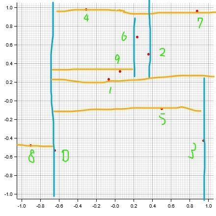
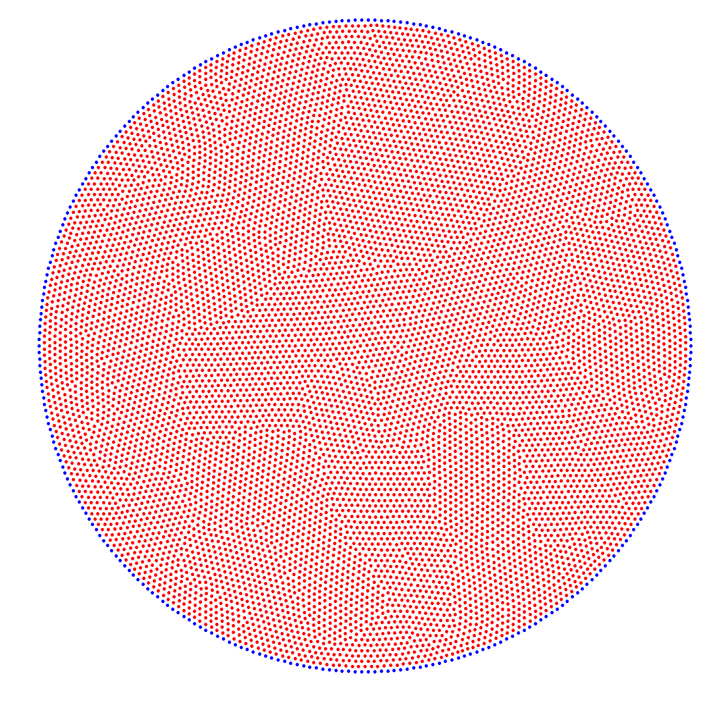
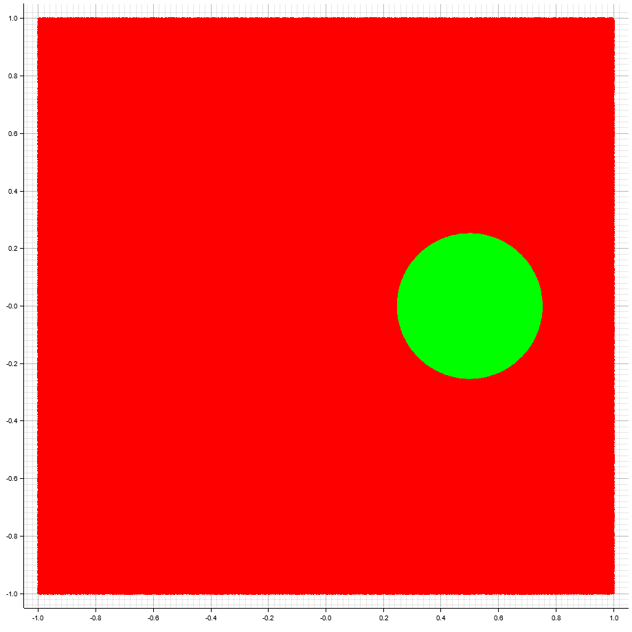

# 最近傍探索

## 点群の生成

レナード-ジョーンズ・ポテンシャルを用いる。

$$
U(r) = 4 \epsilon \left[ \left\lbrace \frac{\sigma}{r} \right\rbrace^{12} - \left\lbrace \frac{\sigma}{r} \right\rbrace^{6} \right]
$$

ポテンシャルが小さくなるように点が移動するような方程式として単純な以下のモデルを用いた。計算例は以下の方程式を用いている。

$$
\frac{dr}{dt} = - \frac{dU}{dr}
$$

## 計算例

## kd-木を用いた近傍探索

`test` で用いた例。アルゴリズムは参考文献[1]。

結晶粒界のような構造が見られる。

## kd-木の動作テスト

$[-1,1]^2 \in \mathbb{R}^2$ 上に乱数を10000000点（1000万点）ふって動く点から半径0.25の距離未満にある点を緑で表示している。あまりに数が多いので画像が緑と赤で覆われているが点群から出来ている。

## 参考文献

1. [コンピュータ・ジオメトリ―計算幾何学:アルゴリズムと応用](https://www.kindaikagaku.co.jp/book_list/detail/9784764903883/)
